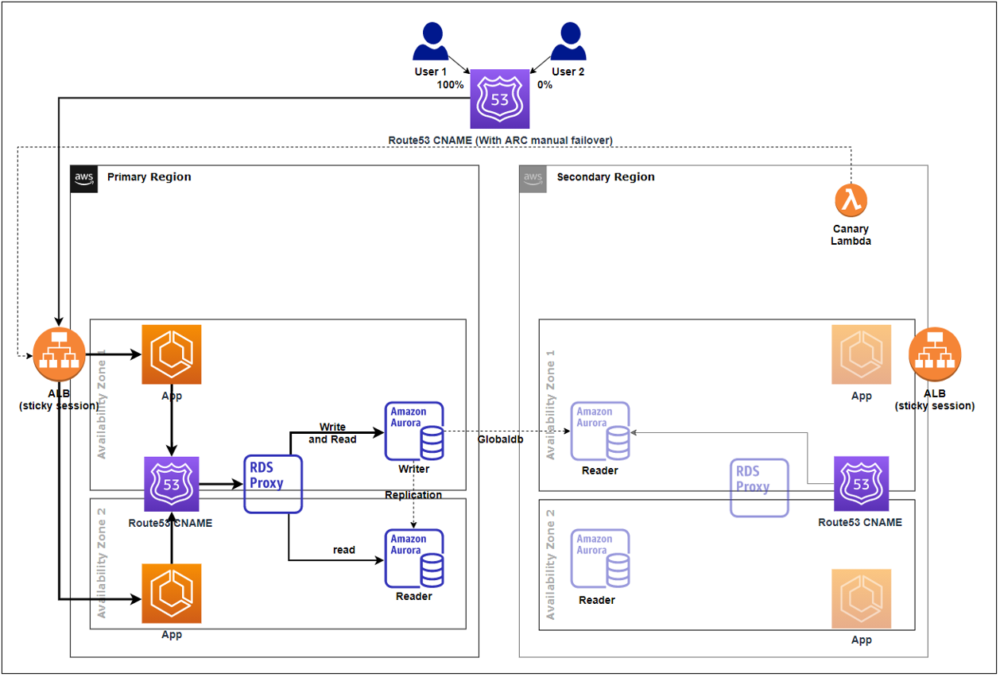
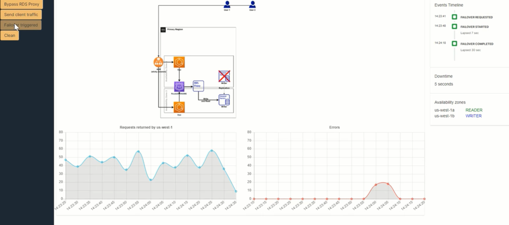
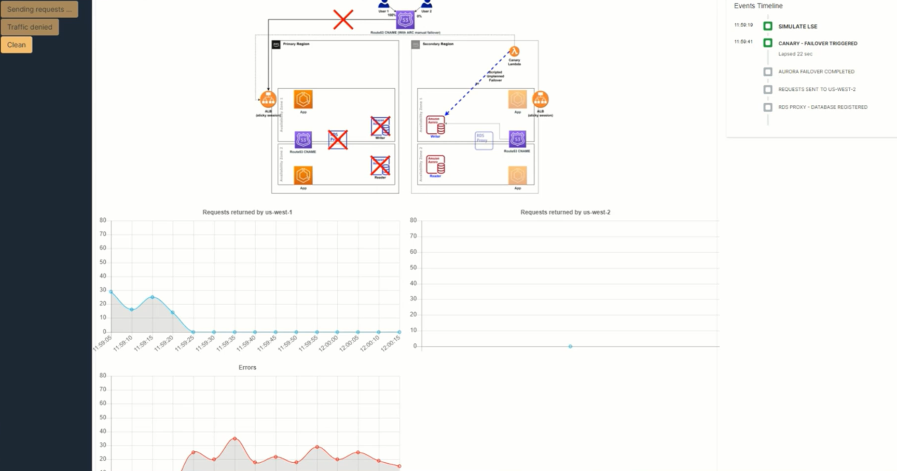

# Amazon Aurora PostgreSQL Fast Failover Demo

## A simple demonstration of in-region (HA) and cross-region (DR) failover automation using Amazon RDS Aurora PostgreSQL Global Database, RDS Proxy and Route53

## Cross-region recovery
- The CloudFormation template sets up a two-region database cluster for Diaster Recoveryand statically stable application routing to the local databse cluster
- A Lambda canary process continually stans the primary region (every 10 seconds) from the secondary region, and enacts failover if it observes 30 seconds of consecutive failures

## In-region recovery
- Each region also contains an RDS Proxy to provide High Availability transparent failover to the failved-over writer in the secondary Availability Zone
- By queueing read and write queries until the reader instance comes back as a writer, RDS Proxy turns what would be SQL errors into a few extra seconds of latency for the application

## DEMOS
- The repository also contains a test application to produce load for the application and log successful calls and errors in a simple UI, and times the failover
- In-region failover with and without RDS proxy

- Cross-region failover with Aurora Global Database, which eventually adds RDS proxy HA after the initial failover

## Security

See [CONTRIBUTING](CONTRIBUTING.md#security-issue-notifications) for more information.

## License

This library is licensed under the MIT-0 License. See the LICENSE file.

